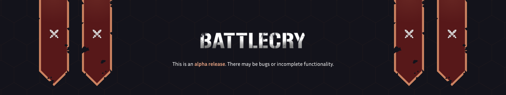

# What is BattleCry?
BattleCry is a **creation kit** for building and playing **2D digital war games** with your friends.

The kit offers a complete user interface for launching and playing war scenarios. These scenarios are
PvP and involve fighting to complete an objective. At this time, these scenarios are designed to work 
with a board game to provide a more in-depth playing experience. For example, games like Undaunted and Memoir 44 
allow players to build maps with tiles and miniatures to create custom battles. Now imagine if these battles were part 
of a larger campaign, where a players' decision in one would have consequences in preceding battles.

## How does it work?
The objective, factions, units, and maps are all defined by the scenario. Scenarios can be created or imported into
BattleCry. You will have to create or import scenarios in order to play. The kit does not provide a playable scenario
out of the box; but it does provide an example of one.

## How do you build scenarios?
Scenarios are built via a scenario definition file. They are very easy to write; we provide a definitions' template and 
documentation make it even easier.

## Pre-release Build Disclaimer
BattleCry is currently in alpha. Current releases are unstable and are not guaranteed to offer backwards compatibility 
for future major changes. Only once a stable version 1.0.0 is released will future major changes support backwards 
compatibility.

## Legality
BattleCry is open source and free. You do not need to pay to download a copy of this software. However, there are 
still limitations as to what you may do with it. Please see our license located in the repository.
